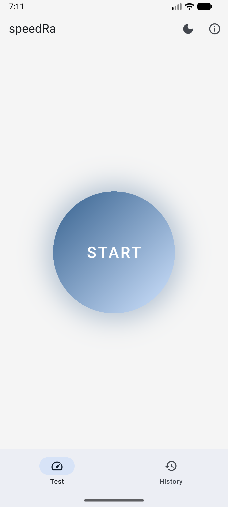
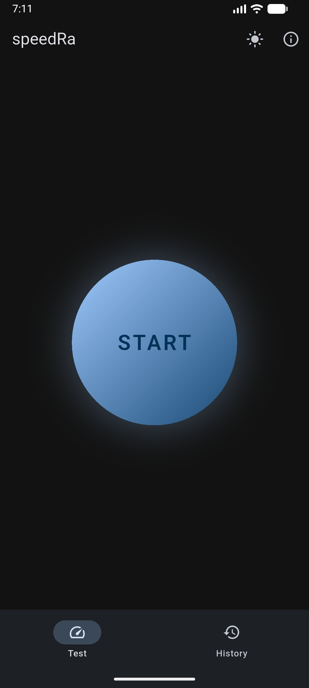
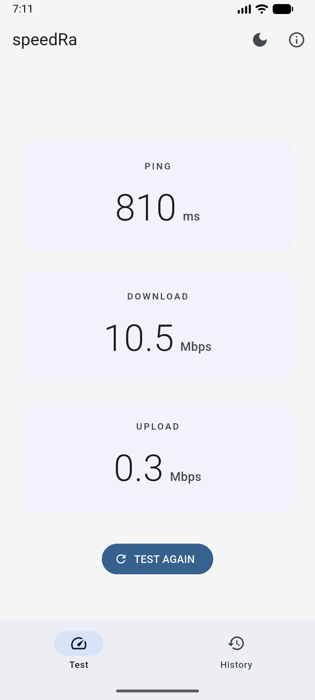
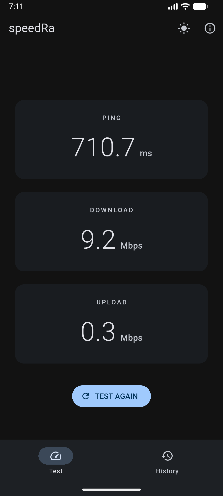
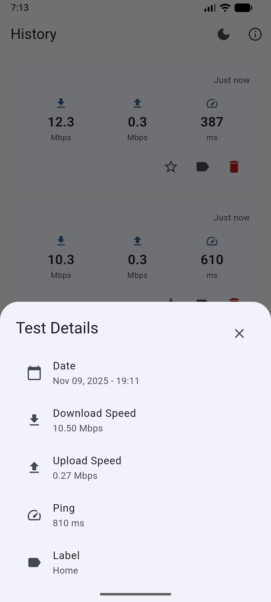
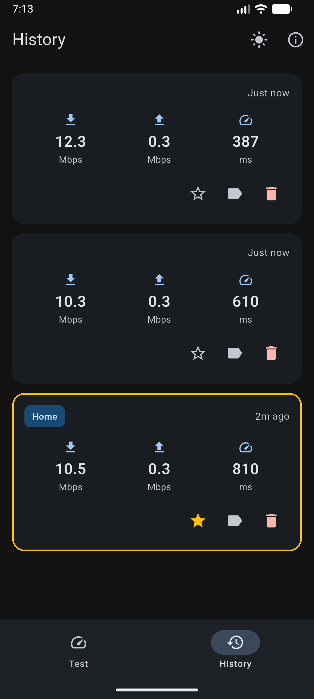

# speedRa ⚡️

<p align="center">
  
  
  
</p>

<p align="center">
  <i>"As the sun god Ra brings light to the world, speedRa illuminates your internet connection."</i>
</p>

---

**speedRa** is a beautiful and powerful internet speed test application built with Flutter. It's designed to be a simple, yet effective tool for measuring your internet performance, while showcasing a clean and scalable architecture for Flutter development.

This project is open-source and free, made with ❤️ for the developer community. We encourage you to explore the code, learn from it, and contribute to its growth.

## Features

- **Comprehensive Speed Test:** Measure your download speed, upload speed, and ping with a single tap.
- **Real-time Results:** See your speed test results in real-time with a smooth and intuitive UI.
- **Test History:** Keep a record of all your previous speed tests to track your internet performance over time.
- **Test Details:** View detailed information for each test, including date, time, and individual metrics.
- **Label and Favorite:** Organize your test history by adding custom labels (e.g., "Home", "Office") and marking important tests as favorites.
- **Dark & Light Mode:** Seamlessly switch between dark and light themes to match your preference.
- **Offline Support:** The app gracefully handles offline states, preventing tests from running without an internet connection and providing clear feedback to the user.

## Architecture

speedRa is built using the principles of **Clean Architecture**. This approach separates the code into independent layers, making the application more scalable, maintainable, and testable.

The project is structured into three main layers:

- **Presentation Layer:** This layer is responsible for the UI and user interaction. It includes widgets, screens, and state management solutions like `flutter_bloc` and `provider`. The UI is kept as "dumb" as possible, reacting to states and events from the domain layer.

- **Domain Layer:** This is the core of the application. It contains the business logic, use cases, and entities. It is completely independent of the other layers, meaning it has no knowledge of the UI or the data sources.

- **Data Layer:** This layer is responsible for fetching data from various sources, such as a remote API or local storage. It implements the repositories defined in the domain layer and handles the actual data retrieval and storage.

This separation of concerns allows for a more robust and flexible application. For example, the data source can be easily swapped without affecting the rest of the application.

## Dependencies

speedRa leverages a set of high-quality, community-trusted packages to provide a modern and efficient development experience.

| Package              | Description                                                                 |
| -------------------- | --------------------------------------------------------------------------- |
| `flutter_bloc`       | For predictable state management and handling of the connectivity status.   |
| `provider`           | For dependency injection and state management of the theme and speed tests. |
| `get_it`             | A simple service locator for dependency injection.                          |
| `connectivity_plus`  | To check the device's internet connectivity status.                         |
| `dartz`              | For functional programming, providing `Either` for error handling.          |
| `http`               | For making network requests to perform the speed test.                      |
| `shared_preferences` | For persisting data locally, such as test history and theme settings.       |
| `equatable`          | To compare objects for equality, used in the BLoC states and events.        |
| `intl`               | For date formatting and internationalization.                               |

## 📸 Screenshots

| Light Mode                                        | Dark Mode                                       |
| :------------------------------------------------ | :---------------------------------------------- |
|  |  |
|  |  |
|  |  |

## 🚀 Getting Started

To get a local copy up and running, follow these simple steps.

### Prerequisites

- [Flutter SDK](https://flutter.dev/docs/get-started/install) (version 3.x or higher)
- [Dart SDK](https://dart.dev/get-dart)

### Installation

1.  Clone the repo
    ```sh
    git clone https://github.com/ansgrb/speedra.git
    ```
2.  Navigate to the project directory
    ```sh
    cd speedra
    ```
3.  Install dependencies
    ```sh
    flutter pub get
    ```
4.  Run the app
    ```sh
    flutter run
    ```

## Contributing

Contributions are what make the open-source community such an amazing place to learn, inspire, and create. Any contributions you make are **greatly appreciated**.

If you have a suggestion that would make this better, please fork the repo and create a pull request. You can also simply open an issue with the tag "enhancement".

Don't forget to give the project a star! Thanks again!

1.  Fork the Project
2.  Create your Feature Branch (`git checkout -b feature/AmazingFeature`)
3.  Commit your Changes (`git commit -m 'Add some AmazingFeature'`)
4.  Push to the Branch (`git push origin feature/AmazingFeature`)
5.  Open a Pull Request

## License

Distributed under the MIT License. See `LICENSE` for more information.
